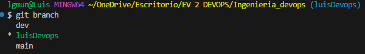
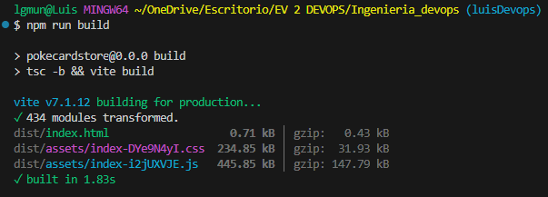
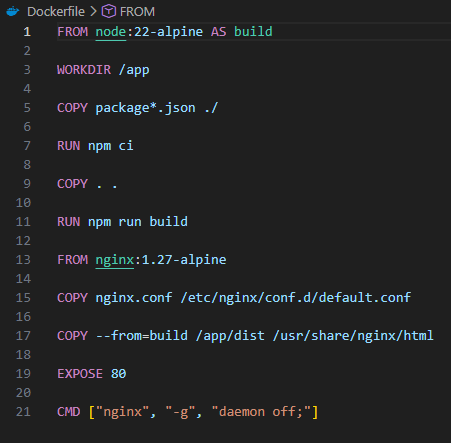
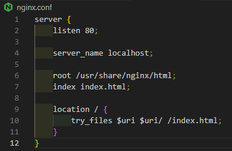
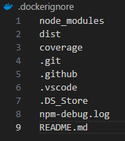
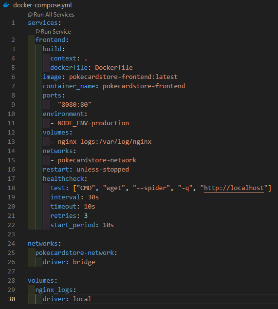
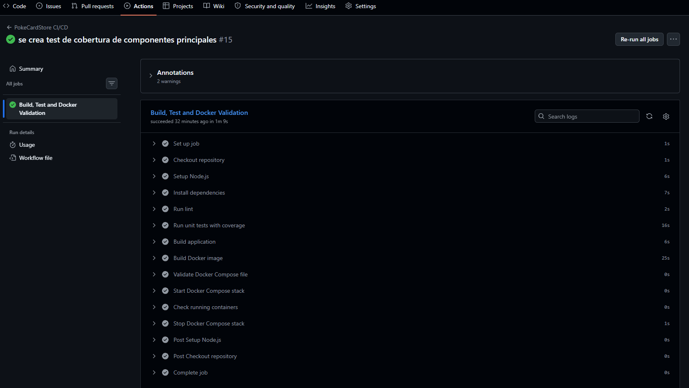
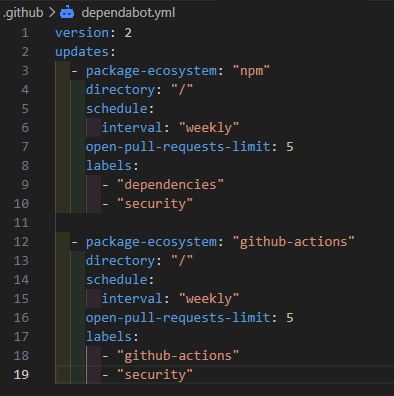
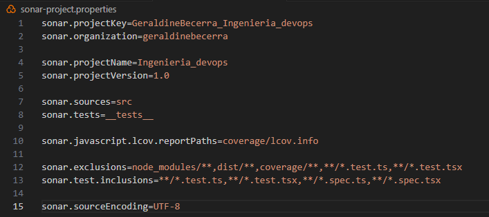

# Evaluacion Parcial N2 - Ingenieria DevOps

## Integrantes

- Luis Guillermo Muñoz Soto
- Geraldine Becerra

---

# Proyecto

PokeCardStore es una aplicacion web desarrollada con React, TypeScript y Vite, orientada a la visualizacion y gestion de cartas Pokemon.

Para esta evaluacion se incorporaron practicas DevOps mediante contenedores Docker, orquestacion con Docker Compose, pipeline CI/CD en GitHub Actions, pruebas automatizadas, analisis de dependencias, analisis estatico de codigo y validacion de despliegue en un entorno simulado.

---

# Objetivos

- Contenerizar la aplicacion utilizando Docker.
- Implementar orquestacion mediante Docker Compose.
- Automatizar integracion continua y entrega continua con GitHub Actions.
- Ejecutar pruebas automatizadas dentro del pipeline.
- Incorporar analisis de seguridad y calidad.
- Configurar bloqueos automaticos si fallan las validaciones.
- Documentar trazabilidad y calidad del pipeline.

# Desarrollo de la Solución

## 1. Rama de trabajo

Para desarrollar esta evaluacion se utilizo la rama:

```text
luisDevops
```

Esta rama permitio implementar y validar las configuraciones DevOps sin afectar el flujo principal del proyecto.

### Evidencia



## 2. Validacion inicial del proyecto

Antes de implementar los cambios DevOps se verifico el funcionamiento base de la aplicacion.

### Comandos ejecutados

```bash
npm install
npm run lint
npm run build
npm test
```

Estas validaciones permiten confirmar que el proyecto compila y que las pruebas automatizadas se ejecutan correctamente.

### Evidencia



## 3. Dockerizacion de la aplicacion

Se creo un `Dockerfile` multi-stage para construir la aplicacion React y servir los archivos de produccion con Nginx.

### Caracteristicas implementadas

- Imagen de construccion `node:22-alpine`.
- Instalacion reproducible con `npm ci --no-audit`.
- Generacion de build productivo con `npm run build`.
- Imagen final `nginxinc/nginx-unprivileged:1.27-alpine`.
- Ejecucion sin usuario root.
- Puerto interno `8080`.
- Configuracion Nginx compatible con SPA mediante `try_files`.

### Beneficios

- Imagen final mas liviana.
- Separacion entre etapa de compilacion y etapa de ejecucion.
- Menor superficie de riesgo al ejecutar Nginx sin privilegios root.
- Entorno reproducible para despliegue.

### Evidencia



## 4. Configuracion de Nginx

Se incorporo `nginx.conf` para servir correctamente la aplicacion React y permitir rutas internas del frontend.

Configuracion relevante:

```nginx
listen 8080;
try_files $uri $uri/ /index.html;
```

### Evidencia



## 5. Archivo .dockerignore

Se configuro `.dockerignore` para evitar copiar archivos innecesarios al contexto Docker.

Se excluyen:

- `node_modules`
- `dist`
- `coverage`
- `.git`
- `.github`
- evidencias PNG
- documentos README auxiliares
- `Estudiante.pdf`

Esto reduce el contexto de build y evita incluir archivos que no son necesarios para la imagen final.

### Evidencia



## 6. Orquestacion con Docker Compose

Se implemento `docker-compose.yml` para levantar un entorno simulado de ejecucion local.

### Configuracion implementada

| Caracteristica | Estado |
| --- | --- |
| Servicio frontend | Implementado |
| Build desde Dockerfile | Implementado |
| Imagen propia | Implementado |
| Puerto expuesto `8080:8080` | Implementado |
| Variables de entorno | Implementado |
| Red personalizada | Implementado |
| Volumen para logs Nginx | Implementado |
| Healthcheck HTTP | Implementado |
| Restart policy | Implementado |
| Limites y reservas de CPU/memoria | Implementado |
| `read_only` filesystem | Implementado |
| `no-new-privileges` | Implementado |
| `cap_drop: ALL` | Implementado |

### Comandos

```bash
docker compose config
docker compose up -d --build
docker compose ps
docker compose down
```

### Evidencia



## 7. Pipeline CI/CD con GitHub Actions

Se configuro el pipeline `.github/workflows/build.yml`, ejecutado automaticamente en:

- `push` a `main`, `dev` y `luisDevops`.
- `pull_request` hacia `main` y `dev`.

### Etapas del pipeline

| Etapa | Comando/Herramienta | Proposito |
| --- | --- | --- |
| Checkout | `actions/checkout@v4` | Obtener codigo fuente e historial para trazabilidad |
| Setup Node | `actions/setup-node@v4` | Preparar Node.js 22 con cache npm |
| Dependencias | `npm ci` | Instalacion reproducible |
| Lint | `npm run lint` | Validacion estatica local |
| Pruebas | `npm test -- --single-run` | Ejecutar pruebas automatizadas con cobertura |
| Auditoria dependencias | `npm audit --omit=dev --audit-level=high` | Bloquear vulnerabilidades altas o criticas productivas |
| Build app | `npm run build` | Compilar aplicacion |
| Build Docker | `docker build` | Construir imagen del frontend |
| Escaneo imagen | Trivy | Bloquear vulnerabilidades altas o criticas corregibles |
| SonarCloud | SonarQube Scan Action v6 | Analisis estatico y Quality Gate |
| Validar Compose | `docker compose config` | Validar sintaxis de orquestacion |
| Despliegue simulado | `docker compose up -d --build` | Levantar entorno simulado |
| Healthcheck | `curl http://localhost:8080` | Confirmar disponibilidad |
| Limpieza | `docker compose down` | Apagar entorno |

### Evidencia



## 8. Seguridad y bloqueos

El pipeline falla automaticamente cuando:

- ESLint detecta errores.
- Alguna prueba automatizada falla.
- `npm audit` detecta vulnerabilidades `high` o superiores en dependencias de produccion.
- Trivy detecta vulnerabilidades `HIGH` o `CRITICAL` corregibles en la imagen Docker.
- SonarCloud no aprueba el Quality Gate.
- Docker Compose no es valido.
- El despliegue simulado no responde en `http://localhost:8080`.

## 9. Dependabot

Dependabot esta configurado en `.github/dependabot.yml` para revisar semanalmente:

- Dependencias `npm`.
- Dependencias de GitHub Actions.

Las actualizaciones se generan como pull requests etiquetados con:

- `dependencies`
- `security`
- `github-actions`

### Evidencia



## 10. SonarCloud

Se configuro `sonar-project.properties` para analizar el codigo fuente y asociar los reportes de cobertura generados por Karma.

Configuracion relevante:

```properties
sonar.sources=src
sonar.tests=__tests__
sonar.javascript.lcov.reportPaths=coverage/lcov.info
sonar.qualitygate.wait=true
sonar.scanner.skipJreProvisioning=true
```

Para que GitHub Actions ejecute SonarCloud correctamente, se configura secret:

```text
SONAR_TOKEN
```

### Evidencia



![Configuracion SonarCloud]


## 11. Pruebas automatizadas y cobertura

El proyecto utiliza:

- Jasmine como framework de pruebas.
- Karma como test runner.
- `karma-coverage` para reportes de cobertura.

### Pruebas implementadas

- `App`
- `Compras`
- `Counter`
- `Formulario`
- `Login`
- `Noticias`
- `Pago`
- `Perfil`
- `PokeContainer`
- `PokeList`
- `Registro`

### Cobertura inicial

| Metrica | Resultado |
| --- | --- |
| Statements | 35.60% |
| Branches | 21.11% |
| Functions | 29.83% |
| Lines | 37.58% |

### Evidencia


### Cobertura final validada

| Metrica | Resultado |
| --- | --- |
| Statements | 54.89% |
| Branches | 36.66% |
| Functions | 50.40% |
| Lines | 57.54% |

### Evidencia


## 12. Trazabilidad y calidad

La trazabilidad se garantiza porque cada cambio enviado al repositorio queda asociado a una ejecucion del workflow en GitHub Actions. Esa ejecucion registra:

- Commit.
- Rama.
- Pull request asociado, cuando corresponda.
- Resultado de lint.
- Resultado de pruebas.
- Reporte de cobertura.
- Auditoria de dependencias.
- Build de aplicacion.
- Build de imagen Docker.
- Escaneo de imagen.
- Analisis SonarCloud.
- Validacion y despliegue simulado con Docker Compose.

La calidad se controla antes del despliegue. Si alguna validacion falla, el pipeline termina con error y la entrega queda bloqueada.


## 13. Validaciones ejecutadas

Durante la revision final se ejecutaron las siguientes validaciones:

```bash
npm.cmd run lint
npm.cmd run build
npm.cmd test -- --single-run
npm.cmd audit --omit=dev --audit-level=high
docker build -t pokecardstore-frontend:ci .
docker compose config
docker compose up -d --build
docker compose ps
docker compose down
```

Resultados:

- Lint: OK.
- Build: OK.
- Tests: 24 pruebas exitosas.
- Auditoria productiva: 0 vulnerabilidades.
- Docker build: OK.
- Docker Compose config: OK.
- Despliegue simulado: OK.
- Healthcheck: `healthy`.

# Conclusión

Durante esta evaluación se logró incorporar exitosamente prácticas DevOps al proyecto PokeCardStore mediante la implementación de contenedores Docker, orquestación con Docker Compose y automatización de procesos a través de GitHub Actions. Además, se integraron mecanismos de análisis de dependencias y se fortaleció la calidad del software mediante la creación de nuevas pruebas automatizadas que permitieron aumentar significativamente la cobertura del proyecto.

La solución desarrollada proporciona un entorno reproducible, automatizado y fácilmente desplegable, facilitando futuras tareas de integración, mantenimiento y evolución de la aplicación. Asimismo, la estructura implementada constituye una base sólida para continuar incorporando herramientas de calidad y seguridad dentro del ciclo de desarrollo.
